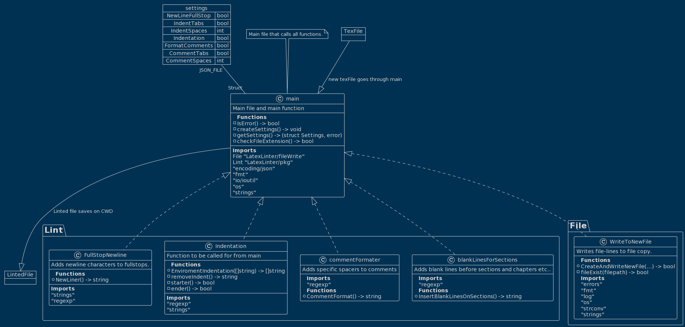

# PA1456-Individuellt

## Compile instructions

*(Requires GO installed on local machine)*


If you just want to build the program for the native operating system simply stand in the main.go directory (this one) and run the bash command `go build`.
<details>
<summary> MacOS </summary>

to compile for MacOS run:

```bash
GOOS=darwin GOARCH=amd64 go build -o main.exe main.go
```
You might need to do chmod +x main.exe before.

</details>

<details>
<summary>Linux</summary>

To compile for Linux run the bash command:

```bash
GOOS=linux GOARCH=amd64 go build -o main.exe main.go
```
</details>


<details>
<summary>Windows</summary>

To compile for windows machines run the bash command: 

```bash
GOOS=windows GOARCH=amd64 go build -o main.exe main.go
```

</details>

---

## Run instructions

To run the program simply do `./LatexLinter [PATH TO TEX FILE]`

If you would like to change the settings of the program, simply edit the <i>settings.json</i> file.

## Schema on project
